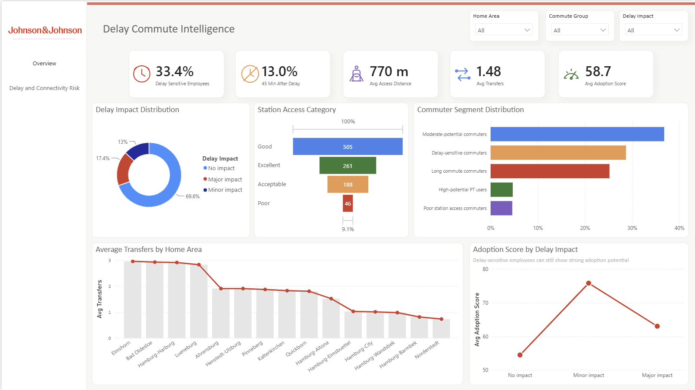
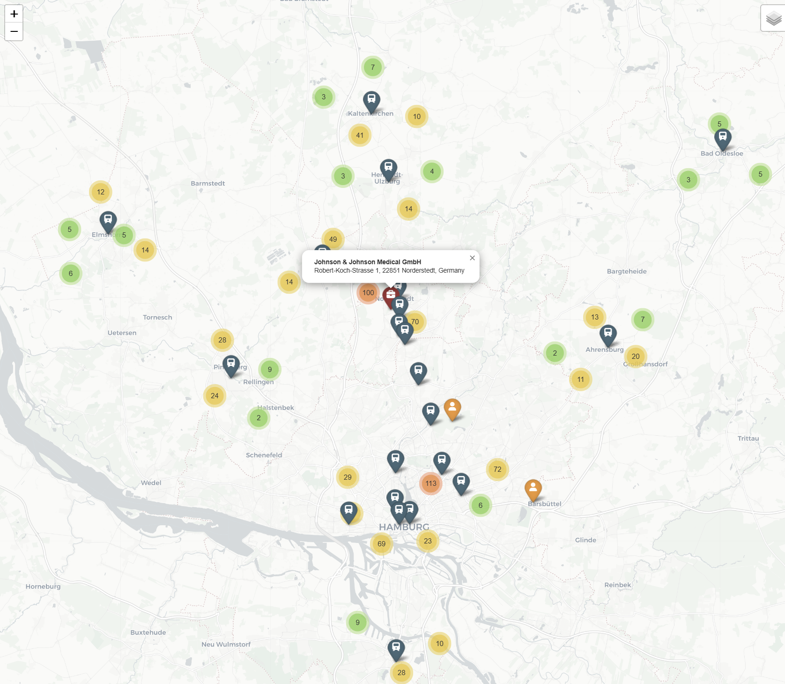

# Employee Commute Intelligence & Deutschlandticket Adoption Analysis

This repository contains a technical assessment project focused on employee commute accessibility, public transport convenience, delay sensitivity, and Deutschlandticket adoption potential for employees commuting to the Johnson & Johnson Medical GmbH site in Norderstedt, Germany.

The project was built as an end-to-end analytics workflow: synthetic employee data generation, commute feature engineering, public transport accessibility analysis, adoption scoring, commuter segmentation, geospatial mapping, and a two-page Power BI dashboard.

> **Note:** This project uses synthetic employee data only. No real employee data is included.  
> The Johnson & Johnson logo is used only for technical assessment and dashboard demonstration purposes.

---

## Dashboard Preview

### Commute Intelligence Overview


### Delay Commute Intelligence



---

## Project Objective

The objective of this technical assessment was to design a data-driven solution that can help evaluate employee commute patterns and identify opportunities for Deutschlandticket adoption.

The analysis answers questions such as:

- Where do employees commute from?
- Which areas have stronger or weaker public transport accessibility?
- How does delay affect commute attractiveness?
- Which employees cross the 45-minute commute threshold after delay?
- Which employees are most likely to benefit from the Deutschlandticket?
- Which commuter groups should be prioritized for mobility support?

The final solution is designed for both technical reviewers and business stakeholders by combining reproducible Python analysis with an interactive Power BI dashboard and Folium map.

---

## End-to-End Analytics Pipeline

```text
Synthetic Employee Data
        ↓
Data Validation & Cleaning
        ↓
Commute Feature Engineering
        ↓
Public Transport Accessibility Analysis
        ↓
Delay Sensitivity Modeling
        ↓
Deutschlandticket Adoption Scoring
        ↓
Commuter Segmentation
        ↓
Power BI Dashboard + Folium Map + Summary Outputs
```

---

## Pipeline Implementation

### 1. Synthetic Employee Data Generation

A synthetic dataset of 1,000 employees was generated across Norderstedt, Hamburg, and surrounding regional areas. Each employee record includes a home area, approximate latitude and longitude, and commute-relevant attributes.

```python
# Synthetic employee dataset generation
employees = generate_synthetic_employees(
    n_employees=1000,
    workplace_lat=53.7017,
    workplace_lon=9.9846
)
```

Output:

```text
data/synthetic/synthetic_employees.csv
```

---

### 2. Data Validation and Preprocessing

The synthetic employee dataset is validated before analysis. This step ensures required fields are available, employee records are consistent, and the data is ready for commute feature engineering.

```python
# Validate employee records before feature engineering
validated_employees = validate_employee_data(employees)
```

Output:

```text
data/processed/validated_employees.csv
```

---

### 3. Commute Feature Engineering

Commute-related features are calculated for each employee, including estimated commute duration, delay-adjusted commute duration, commute group, station access distance, and number of transfers.

```python
# Generate commute and accessibility features
commute_features = calculate_commute_features(
    employees=validated_employees,
    transport_stations=stations
)
```

Important engineered fields:

```text
base_commute_time_min
risk_adjusted_commute_time_min
base_commute_group
risk_adjusted_commute_group
nearest_public_transport_access_m
number_of_transfers
```

Output:

```text
data/processed/employee_commute_features.csv
```

---

### 4. Delay Sensitivity Analysis

A delay-adjusted commute scenario is used to identify employees whose commute becomes less attractive after disruption. A key risk indicator flags employees who move from within 45 minutes to above 45 minutes after delay.

```python
# Identify employees crossing the 45-minute threshold after delay
commute_features["crosses_45_min_after_delay"] = (
    (commute_features["base_commute_time_min"] <= 45) &
    (commute_features["risk_adjusted_commute_time_min"] > 45)
)
```

This logic supports the delay-risk section of the Power BI dashboard.

---

### 5. Deutschlandticket Adoption Scoring

A transparent scoring framework estimates Deutschlandticket adoption potential using commute convenience, public transport access, transfer complexity, and delay sensitivity.

```python
# Calculate adoption score and adoption potential group
scored_employees = calculate_adoption_scores(commute_features)
```

The scoring framework classifies employees into:

```text
Very High
High
Medium
Low
```

Output:

```text
data/processed/adoption_scoring_output.csv
```

---

### 6. Commuter Segmentation

Employees are grouped into practical commuter segments based on adoption score, commute time, delay sensitivity, and station access quality.

```python
# Assign commuter segments for dashboard analysis
segmented_employees = assign_commuter_segments(scored_employees)
```

Example commuter segments:

```text
High-potential PT users
Moderate-potential commuters
Delay-sensitive commuters
Long commute commuters
Poor station access commuters
```

These segments are used directly in the dashboard to support targeted mobility recommendations.

---

## Interactive Folium Map

The project includes an interactive Folium map for geospatial commute exploration.

### Folium Map Preview



The interactive HTML map is available at:

```text
outputs/maps/commute_map.html
```

The map visualizes employee commute distribution around the Johnson & Johnson Medical GmbH workplace location in Norderstedt and supports geographic exploration of commute accessibility patterns.

---

## Power BI Dashboard

The final dashboard is stored at:

```text
dashboard/powerbi_dashboard.pbix
```

The dashboard uses the processed Power BI dataset:

```text
data/processed/powerbi_dashboard_data.csv
```

### Dashboard Page 1: Commute Intelligence Overview

This page provides an executive-level view of the commute landscape.

Main components:

- Total employees
- Average base commute time
- Average delay-adjusted commute time
- High adoption potential percentage
- Employees within 45 minutes
- Employee commute map
- Adoption score by area
- Base vs delay-adjusted commute groups
- Adoption potential distribution
- Commute risk matrix

### Dashboard Page 2: Delay Commute Intelligence

This page focuses on delay sensitivity, connectivity barriers, and public transport friction.

Main components:

- Delay-sensitive employee percentage
- Employees crossing 45 minutes after delay
- Average public transport access distance
- Average number of transfers
- Average adoption score
- Delay impact distribution
- Station access category
- Commuter segment distribution
- Average transfers by home area
- Adoption score by delay impact
- Connectivity risk matrix

---

## Technical Assessment Coverage

| Assessment Area | Implementation |
|---|---|
| Synthetic employee data | Generated 1,000 synthetic employee commute records |
| Data preprocessing | Validated and prepared employee commute data |
| Feature engineering | Created commute time, delay, station access, and transfer features |
| Adoption analysis | Built a transparent scoring model for Deutschlandticket adoption potential |
| Risk analysis | Modeled delay impact and 45-minute commute threshold crossing |
| Segmentation | Classified employees into actionable commuter groups |
| Dashboarding | Built a two-page Power BI dashboard for business review |
| Geospatial analysis | Created an interactive Folium commute map |
| Reproducibility | Organized notebook, modular Python scripts, processed datasets, and output files |

---

## Tools and Technologies

- Python
- Pandas
- NumPy
- Scikit-learn / scoring logic
- Matplotlib
- Folium
- Power BI
- DAX
- Jupyter Notebook
- Git / GitHub

---

## Main Outputs

| Output | Location |
|---|---|
| Final Power BI dataset | `data/processed/powerbi_dashboard_data.csv` |
| Adoption scoring output | `data/processed/adoption_scoring_output.csv` |
| Commute feature dataset | `data/processed/employee_commute_features.csv` |
| Interactive Folium map | `outputs/maps/commute_map.html` |
| Folium map screenshot | `outputs/maps/map.png` |
| Power BI dashboard | `dashboard/powerbi_dashboard.pbix` |
| Dashboard screenshots | `dashboard/screenshots/` |

---

## Project Structure

```text
jnj-employee-commute-intelligence/
│
├── data/
│   ├── raw/
│   │   └── transport_stations.csv
│   ├── synthetic/
│   │   └── synthetic_employees.csv
│   └── processed/
│       ├── validated_employees.csv
│       ├── employee_commute_features.csv
│       ├── adoption_scoring_output.csv
│       └── powerbi_dashboard_data.csv
│
├── notebooks/
│   └── 01_commute_accessibility_analysis.ipynb
│
├── src/
│   ├── config.py
│   ├── synthetic_data.py
│   ├── transport_data.py
│   ├── preprocessing.py
│   ├── commute_calculator.py
│   ├── scoring.py
│   ├── segmentation.py
│   ├── reporting.py
│   ├── visualization.py
│   ├── map_visualization.py
│   └── utils.py
│
├── outputs/
│   ├── charts/
│   ├── maps/
│   │   ├── commute_map.html
│   │   └── map.png
│   └── summary/
│
├── dashboard/
│   ├── powerbi_dashboard.pbix
│   ├── assets/
│   └── screenshots/
│       ├── overview_dashboard.png
│       └── delay_commute_intelligence.png
│
├── requirements.txt
└── README.md
```

---

## How to Run the Project

### 1. Clone the repository

```bash
git clone https://github.com/Sherryonroll/jnj-employee-commute-intelligence.git
cd jnj-employee-commute-intelligence
```

### 2. Create a virtual environment

```bash
python -m venv venv
```

Activate the environment:

```bash
# Windows
venv\Scripts\activate
```

```bash
# macOS/Linux
source venv/bin/activate
```

### 3. Install dependencies

```bash
pip install -r requirements.txt
```

### 4. Run the analysis notebook

Open and run:

```text
notebooks/01_commute_accessibility_analysis.ipynb
```

This reproduces the synthetic data generation, preprocessing, commute feature engineering, scoring, segmentation, charts, and Folium map output.

### 5. Open the Power BI dashboard

Open the dashboard file in Power BI Desktop:

```text
dashboard/powerbi_dashboard.pbix
```

---

## Final Dashboard Dataset

The final Power BI dataset includes the following important columns:

```text
employee_id
home_area
latitude
longitude
base_commute_time_min
risk_adjusted_commute_time_min
base_commute_group
risk_adjusted_commute_group
nearest_public_transport_access_m
number_of_transfers
delay_impact
crosses_45_min_after_delay
adoption_score
adoption_potential
commuter_segment
```

---

## Key Insights

- A meaningful share of employees are delay-sensitive under the modeled commute-risk scenario.
- Some employees cross the 45-minute commute threshold after delay, which may reduce commute attractiveness.
- Station access distance and number of transfers are important barriers to Deutschlandticket adoption.
- High-potential public transport users can be identified using commute time, adoption score, station access, and transfer complexity.
- Commuter segmentation creates a practical basis for targeted mobility support and benefit planning.

---

## Assumptions

- The employee dataset is synthetic and created only for this technical assessment.
- Commute estimates are modeled for analytical demonstration and are not real-time route calculations.
- Public transport accessibility is approximated using station distance and number of transfers.
- Adoption potential is estimated through a transparent scoring framework.
- Delay impact is modeled using a fixed delay buffer and commute threshold logic.

