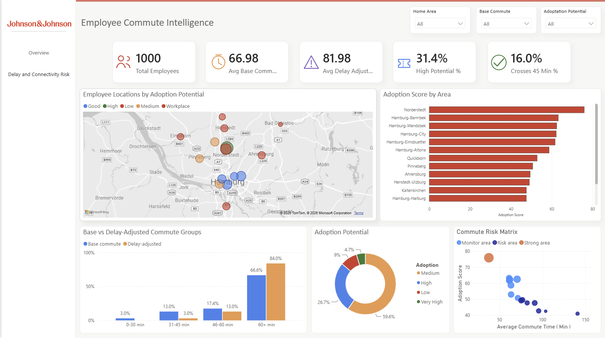

# Employee Commute Intelligence & Deutschlandticket Adoption Analysis

This repository contains a technical assessment project focused on analyzing employee commute accessibility, public transport convenience, and potential Deutschlandticket adoption for employees commuting to the Johnson & Johnson Medical GmbH site in Norderstedt, Germany.

The project combines synthetic employee data generation, commute feature engineering, accessibility scoring, delay-risk analysis, segmentation, interactive mapping, and a two-page Power BI dashboard. The goal is to demonstrate how data science and analytics can support mobility planning, employee benefit decisions, and public transport adoption strategy.

> Note: This project uses synthetic employee data only. No real employee data is included. The Johnson & Johnson logo is used only for technical assessment and dashboard demonstration purposes.

---

## Dashboard Preview

### Commute Intelligence Overview



### Delay & Connectivity Risk


---

## Project Objective

The assessment task was approached as a complete end-to-end analytics solution:

- Generate a realistic synthetic employee commute dataset
- Enrich employee records with commute and public transport accessibility features
- Estimate commute convenience and Deutschlandticket adoption potential
- Identify employees affected by delay and connectivity risks
- Segment commuters into actionable groups
- Build visual outputs for both technical and business users
- Deliver an interactive Power BI dashboard and Folium map

The final output is designed to be understandable for recruiters, technical reviewers, and business stakeholders.

---

## Technical Assessment Coverage

| Requirement Area | Implementation |
|---|---|
| Synthetic employee data | Created 1,000 synthetic employee records across Hamburg, Norderstedt, and surrounding areas |
| Commute analysis | Calculated base commute time, delay-adjusted commute time, and commute groups |
| Public transport accessibility | Estimated nearest public transport access distance and transfer complexity |
| Deutschlandticket adoption potential | Built an adoption scoring framework based on commute time, accessibility, transfers, and delay sensitivity |
| Risk analysis | Added delay impact logic and 45-minute commute threshold analysis |
| Segmentation | Classified employees into commuter segments such as high-potential PT users, delay-sensitive commuters, and poor-access commuters |
| Dashboarding | Built a two-page Power BI dashboard for executive and analytical review |
| Geospatial output | Created an interactive Folium map showing commute distribution and workplace context |
| Reproducibility | Organized code into modular Python scripts and notebook workflow |

---

## Key Insights

- Around one-third of employees show delay sensitivity based on the commute-risk model.
- A meaningful share of employees cross the 45-minute commute threshold after simulated delay.
- Station access distance and number of transfers are important barriers to public transport attractiveness.
- High-potential public transport users can be identified using a combination of adoption score, commute time, and connectivity features.
- The dashboard separates strategic overview from operational delay and connectivity risk, making the analysis easier to interpret.

---

## Methodology

The workflow follows a structured analytics pipeline:

```text
Synthetic Employee Data
        ↓
Data Validation & Cleaning
        ↓
Commute Feature Engineering
        ↓
Public Transport Accessibility Analysis
        ↓
Adoption Scoring & Segmentation
        ↓
Risk Analysis
        ↓
Power BI Dashboard + Folium Map + Summary Outputs